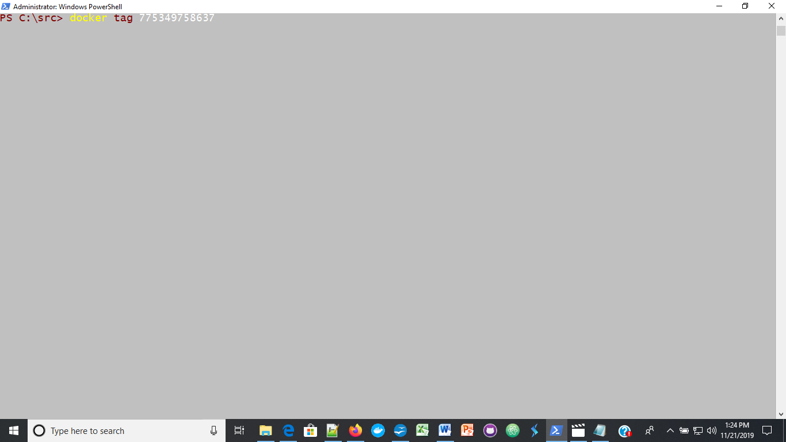

Task3: A step by step tutorial on creating and sharing a Docker repository using Windows 10 and Docker desktop

- [x] Creating and sharing a Docker repository
Login to your docker account with your docker id and password:
1[ Docker Login ](/images/docker_login.png)
To create a Docker repository click on the plus symbol on the top right corner of the window.
Enter repository name in the field provided and provide the description for your repository.
In my case the repository name is mydoc21.

Go to powershell and Log into Docker Hub:
docker login --username = your_username --email = your_email_address
Where your_name is the username you used to create your docker account and 
your_email_address is your email when you created your docker account.

Check the image id using:
docker images

and tag your image:
docker tag 775349758637

### The image will be available for everyone to use